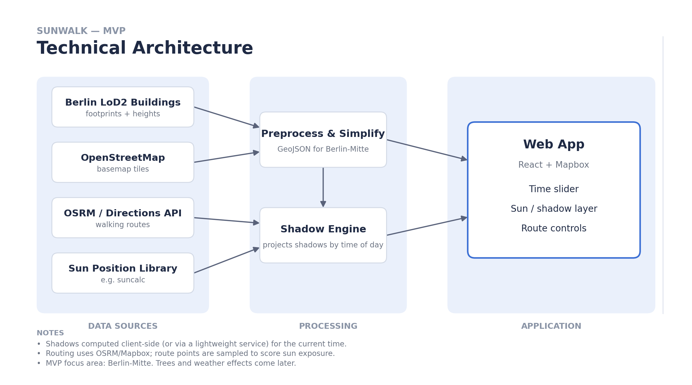

# ☀️ SunWalk - Real-Time Urban Sun & Shade Mapping

**Find sunny or shady walking routes in Berlin**

SunWalk is a mobile-first Progressive Web App (PWA) that maps real-time sun and shade conditions in urban environments, helping users choose the sunniest or shadiest walking routes.



---

## ✨ Features

- 🗺️ **Real-time shadow mapping** - See where shadows fall based on building geometry and sun position
- ☀️ **Sun-optimized routes** - Get walking directions that maximize sun exposure (great for cold days)
- 🌳 **Shade-optimized routes** - Find the coolest path through the city (perfect for hot days)
- ⏰ **Time slider** - Plan your walk by previewing shadows at different times
- 📱 **Mobile PWA** - Install on your phone and use offline

---

## 🚀 Quick Start

### Prerequisites

- Python 3.11+
- Node.js 18+
- npm or yarn

### Backend Setup

```bash
cd backend

# Create virtual environment
python -m venv venv
source venv/bin/activate  # On Windows: venv\Scripts\activate

# Install dependencies
pip install -r requirements.txt

# Copy environment file
cp .env.example .env

# Run the server
uvicorn app.main:app --reload
```

The API will be available at `http://localhost:8000`
- API docs: `http://localhost:8000/docs`
- Health check: `http://localhost:8000/health`

### Frontend Setup

```bash
cd frontend

# Install dependencies
npm install

# Run development server
npm run dev
```

The app will be available at `http://localhost:5173`

---

## 🏗️ Architecture

```
sunwalk/
├── backend/                 # FastAPI Python backend
│   ├── app/
│   │   ├── api/            # REST API endpoints
│   │   ├── core/           # Configuration
│   │   ├── models/         # Pydantic schemas
│   │   └── services/       # Business logic
│   │       ├── solar.py    # Sun position (Pysolar)
│   │       ├── shadow.py   # Shadow calculation
│   │       └── routing.py  # Route optimization
│   ├── requirements.txt
│   └── Dockerfile
│
├── frontend/               # React + Vite PWA
│   ├── src/
│   │   ├── components/    # React components
│   │   ├── hooks/         # Custom React hooks
│   │   ├── services/      # API client
│   │   └── styles/        # CSS
│   ├── package.json
│   └── vite.config.ts
│
├── src/                    # Pre-computed data
│   ├── buildings_mitte.gpkg
│   └── time_masks/        # GeoTIFF shadow masks
│
└── notebooks/             # Jupyter experiments
    └── SunWalk_annotated.ipynb
```

---

## 🌐 API Endpoints

| Endpoint | Method | Description |
|----------|--------|-------------|
| `/api/v1/sun/position` | GET | Get current sun position |
| `/api/v1/shadows/current` | GET | Get current shadow polygons |
| `/api/v1/shadows/at-time` | GET | Get shadows for specific time |
| `/api/v1/routes/optimize` | POST | Calculate optimized route |
| `/api/v1/routes/sun-route` | GET | Quick sun-optimized route |
| `/api/v1/routes/shade-route` | GET | Quick shade-optimized route |

---

## ☁️ Deployment

### Backend (Railway)

```bash
cd backend
railway login
railway init
railway up
```

### Frontend (Vercel)

```bash
cd frontend
vercel
```

Update `frontend/vercel.json` with your Railway API URL.

---

## 🛠️ Tech Stack

**Backend:**
- FastAPI (Python)
- GeoPandas + Shapely
- Pysolar (solar calculations)
- Rasterio (GeoTIFF processing)

**Frontend:**
- React 18 + TypeScript
- Vite + PWA plugin
- MapLibre GL JS
- Mobile-first CSS

**Data:**
- OpenStreetMap (building footprints)
- OSMnx (street network)
- Pre-computed shadow masks (GeoTIFF)

---

## 📍 Coverage

Currently supports **Berlin-Mitte**. More areas coming soon!

---

## 🔬 Research & Experiments

The original prototype was developed in a Jupyter notebook:
- `notebooks/SunWalk_annotated.ipynb` - Full annotated pipeline

---

## 📄 License

MIT License

---

## 👤 Author

**Giovani Bonadiman Goltara**
Urban Research · UX Design · GIS · Data Analysis
